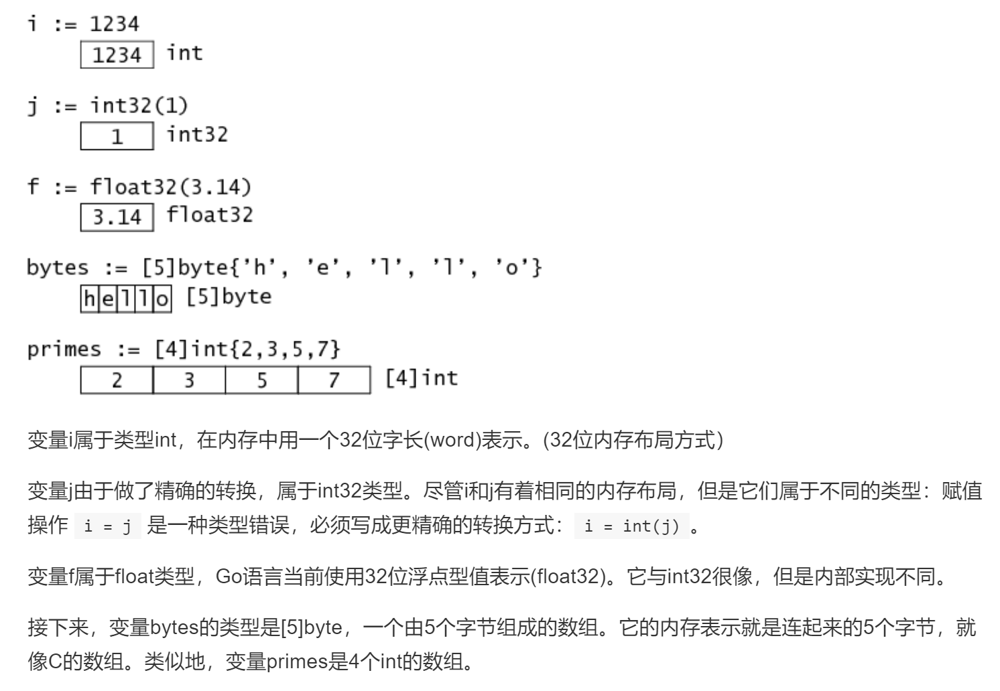

字符串在Go语言内存模型中用一个2字长的数据结构表示。它包含一个指向字符串存储数据的指针和一个长度数据。因为string类型是不可变的，对于多字符串共享同一个存储数据是安全的。切分操作str[i:j]会得到一个新的2字长结构，一个可能不同的但仍指向同一个字节序列(即上文说的存储数据)的指针和长度数据。这意味着字符串切分可以在不涉及内存分配或复制操作。这使得字符串切分的效率等同于传递下标。

在对slice进行append等操作时，可能会造成slice的自动扩容。其扩容时的大小增长规则是：

如果新的大小是当前大小2倍以上，则大小增长为新大小
否则循环以下操作：如果当前大小小于1024，按每次2倍增长，否则每次按当前大小1/4增长。直到增长的大小超过或等于新大小。